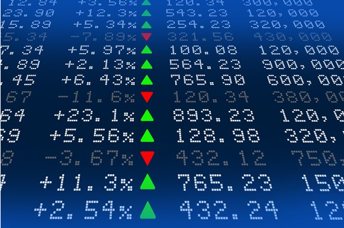
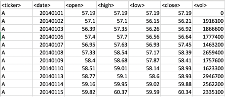
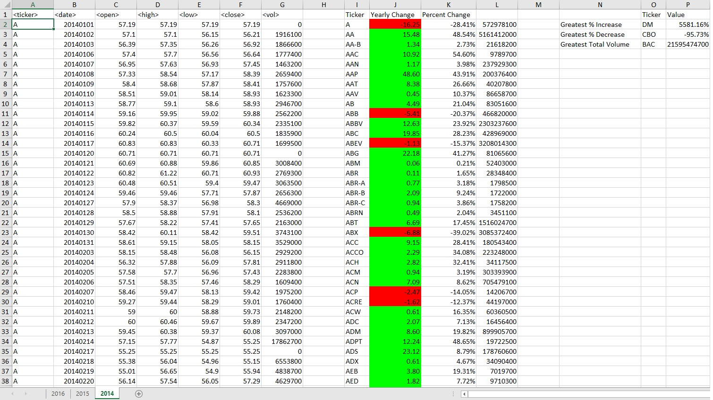
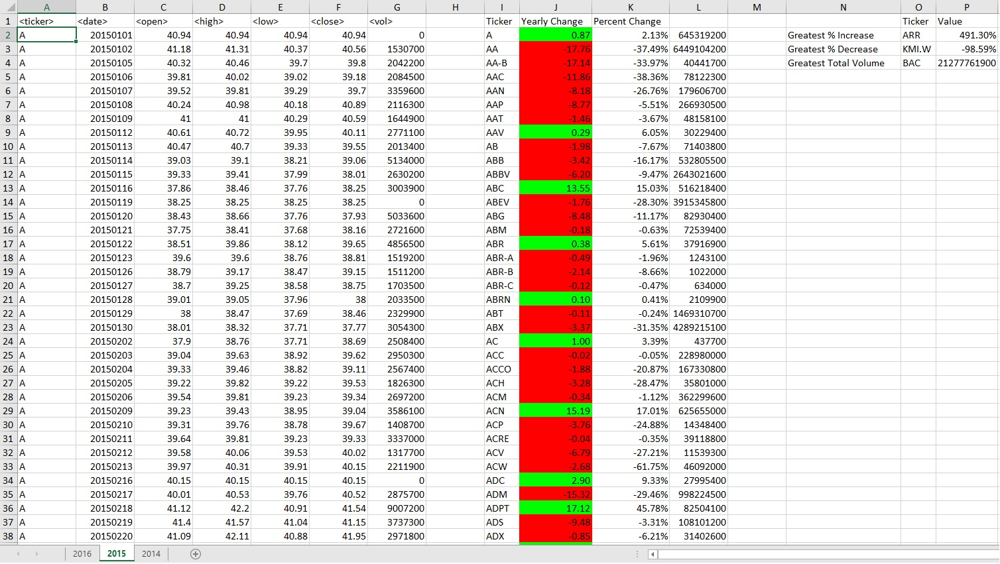
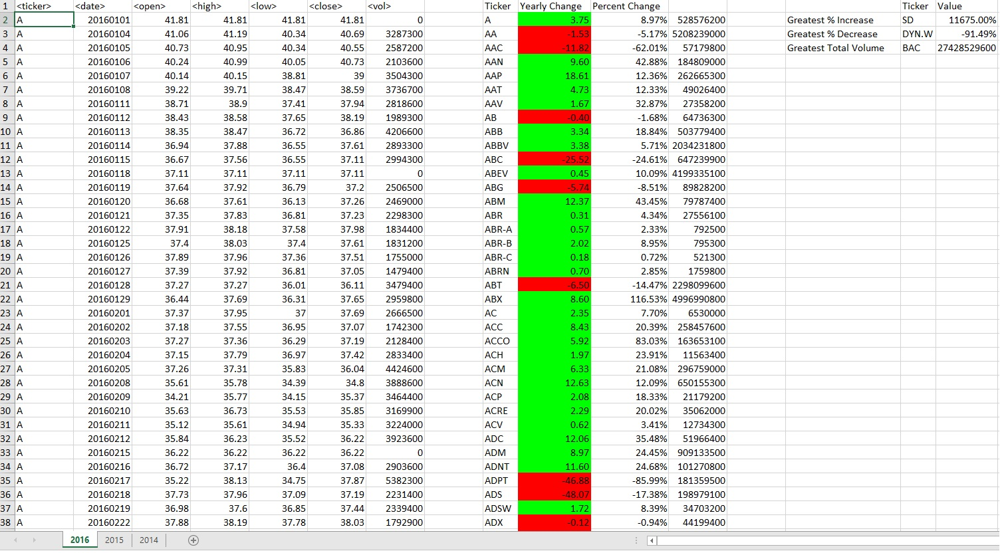

# Equity Trade Record Processing Application

## Background

Trade history records are critical to an organization's reputation and clients. This application efficiently processes and analyzes voluminous trade record data within
Excel using VBA

## Data Overview

## Instructions

Attach code to equity trade extract file via module import and execute the "Run_Program" sub-routine

## Purpose

Allows the decision maker to quickly access "price change", "yearly % change", and "yearly trade volume" for given publicly traded equity securities over the
course of a 262 or 261 business day period. The program also provides the summary statistics, "greatest % increase", "greatest % decrease", and "total trade volume"
for the same period.  If the timeperiod for a security is less than 261 days, data analysis will still be performed.

## Assumptions

1. The program assumes that, "ticker" is a required field and will always be populated
2. If the opening price on the first business day of the year is 0, then the opening price
   on the 2nd business day will contain a non-zero value
3. The worksheet does not contain hidden rows
4. End-user has at least quad-core processing capability or comparible for computational efficiency

## Limitations

1. This solution does not scale and is only for relatively small datasets. As records grow into the millions, a different approach would be needed.
2. Conditional formatting is not applied in the formal sense in order to optimize performance. Cell shading is done as a workaround.

## 2014 Analysis

## 2015 Analysis

## 2016 Analysis

